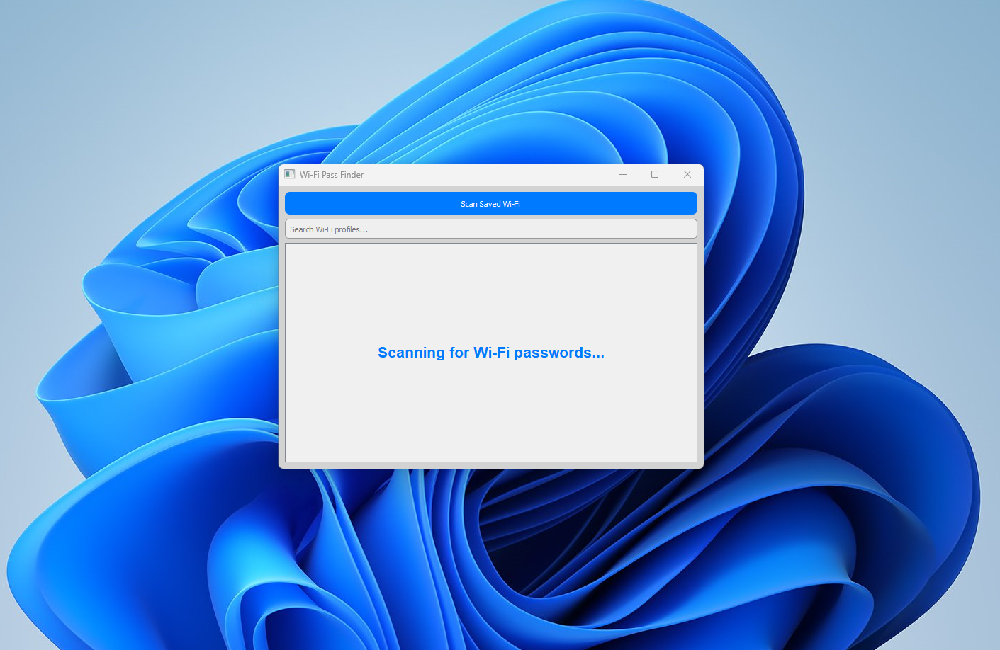

# Wi-Fi Pass Finder

Wi-Fi Pass Finder is a  lightweight software is built with simplicity in mind, allowing you to quickly scan and retrieve all saved wifi passwords on your Windows machine without any hassle. With its user-friendly interface, you can easily navigate through the software and retrieve the passwords with ease.

## Features

- View Saved Password
- Supported on all Windows Os

## Installation

Wi-Fi Pass Finder has a simple  msi installer & Exe File

  [Download Msi Here](https://choosealicense.com/licenses/mit/)

  [Download Exe Here](https://choosealicense.com/licenses/mit/)

    
## Tech Stack

**Client:** PyQt5 

**Server:** Python, Powershell

## Roadmap

- Mac Os & Linux Support

- More integrations

## License

[APACHE](Licence)

## Documentation

[Documentation](documentation.txt)

## Screenshots

